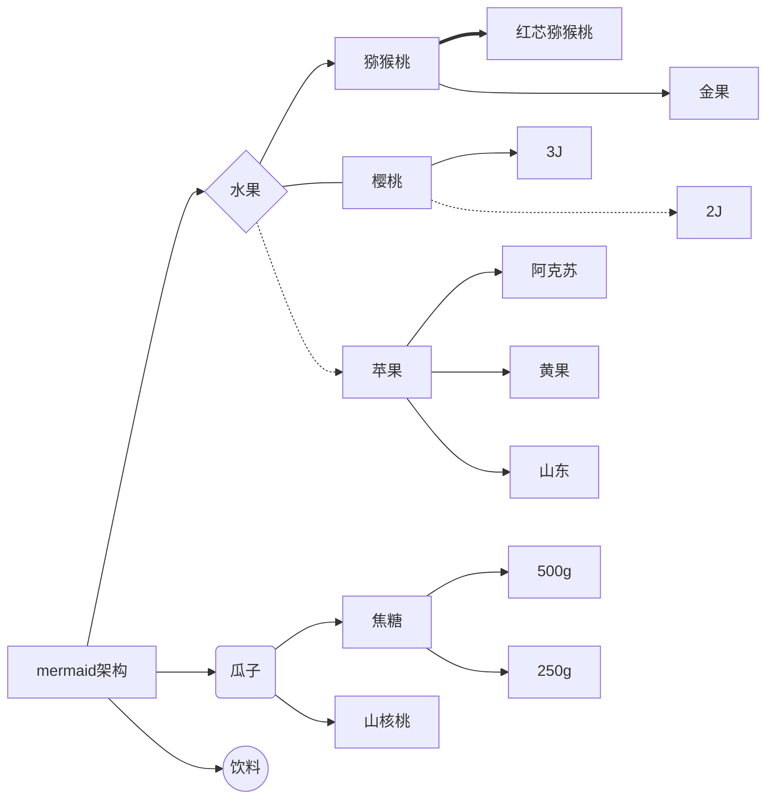
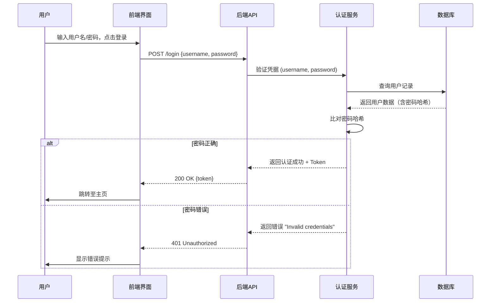
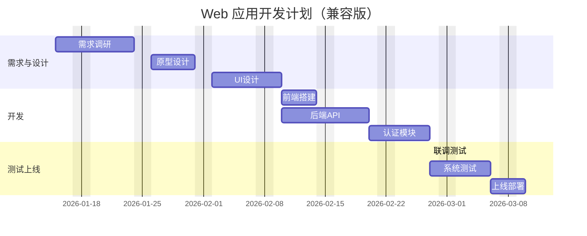

#r/tools

```mermaid
graph LR
Root[mermaid架构]
Root --> A{水果}
Root --> B(瓜子)
Root --> C((饮料))
A --> A1[猕猴桃]
A --- A2[樱桃]
A -.-> A3[苹果]
A1 ==> A11[红芯猕猴桃]
A1 ---> A12[金果]
A2 --> A21[3J]
A2 -..-> A22[2J]
A3 --> A31[阿克苏]
A3 --> A32[黄果]
A3 --> A33[山东]
B --> B1[焦糖]
B --> B2[山核桃]
B1 --> B11[500g]
B1 --> B12[250g]
```

```mermaid
sequenceDiagram
    participant User as 用户
    participant UI as 前端界面
    participant API as 后端API
    participant Auth as 认证服务
    participant DB as 数据库
    User->>UI: 输入用户名/密码，点击登录
    UI->>API: POST /login {username, password}
    API->>Auth: 验证凭据 (username, password)
    Auth->>DB: 查询用户记录
    DB-->>Auth: 返回用户数据（含密码哈希）
    Auth->>Auth: 比对密码哈希
    alt 密码正确
        Auth-->>API: 返回认证成功 + Token
        API-->>UI: 200 OK {token}
        UI->>User: 跳转至主页
    else 密码错误
        Auth-->>API: 返回错误 "Invalid credentials"
        API-->>UI: 401 Unauthorized
        UI->>User: 显示错误提示
    end
```

```mermaid
gantt
    title Web 应用开发计划（兼容版）
    dateFormat  YYYY-MM-DD
    excludes weekends

    section 需求与设计
    需求调研       :a1, 2026-01-15, 7d
    原型设计       :a2, after a1, 5d
    UI设计         :a3, after a2, 6d

    section 开发
    前端搭建       :b1, after a3, 4d
    后端API        :b2, after a3, 8d
    认证模块       :b3, after b2, 5d

    section 测试上线
    联调测试       :c1, after b3, 4d   %% 只依赖一个任务
    系统测试       :c2, after c1, 5d
    上线部署       :c3, after c2, 2d
```
