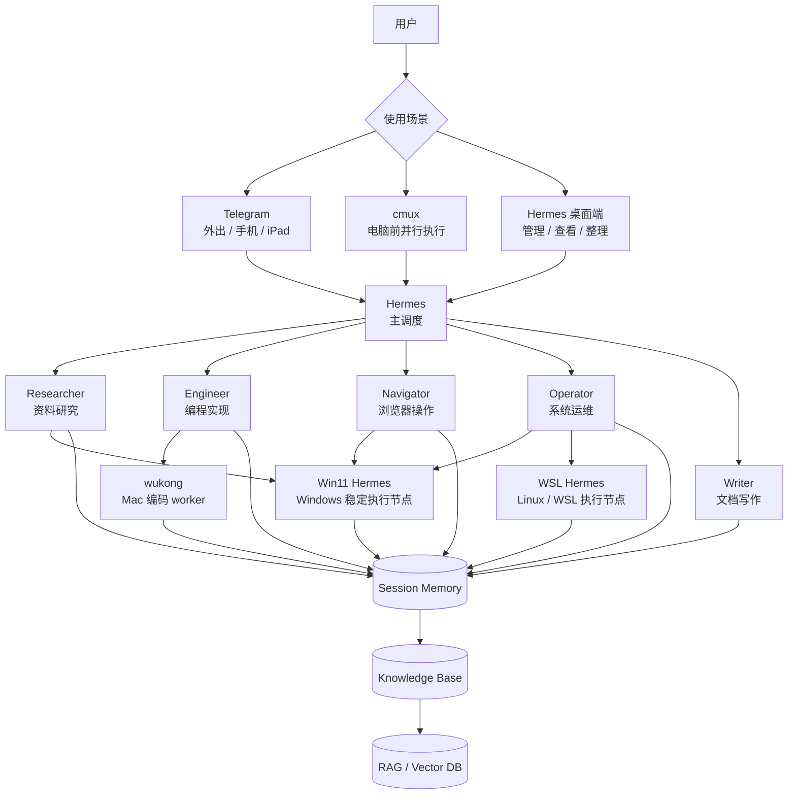

# Hermes 多 Agent 总架构图

这份笔记把主调度、职责层、执行层、记忆层、以及不同使用入口统一放在一张图里。

## 一、总览

## 二、四层结构

### 1. 入口层
你和 Hermes 交互的入口有三种：
- Telegram：外出时用
- cmux：电脑前并行执行时用
- Hermes 桌面端：看全局、整理、管理时用

### 2. 调度层
- Hermes 是唯一主调度
- 负责拆解、分配、协调、收口

### 3. 职责层
核心职责是：
- Researcher：查资料
- Engineer：写代码
- Navigator：浏览器操作
- Operator：系统运维
- Writer：整理成文

### 4. 执行层
真正执行发生在不同 worker / 机器节点上：
- wukong：Mac 编码副手
- Win11 Hermes：稳定在线的台式机节点
- WSL Hermes：Linux / WSL 执行节点

### 5. 记忆层
- Session Memory：当前任务上下文
- Knowledge Base：稳定事实与流程
- RAG / Vector DB：大量资料检索

## 三、工作方式

1. 你从任意入口发起任务
2. Hermes 判断任务类型
3. Hermes 选择对应职责角色
4. Hermes 再选择合适的执行节点
5. 任务完成后回收到共享记忆
6. 需要长期保留的内容再进入知识库

## 四、最重要的原则

- 你只需要对主 Hermes 说话
- 子角色负责专业分工
- worker 负责在合适的环境里执行
- 记忆必须共享，不能各自为政

## 五、这张图的意义

这不是“每个 agent 都是独立大脑”，
而是“一个统一大脑下的多角色、多节点、多入口系统”。
