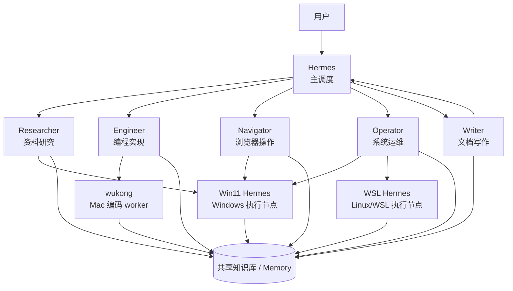

# Hermes 角色关系图

这份笔记说明主 Agent Hermes、六个核心角色、以及 worker / 执行节点之间的关系。

## 一、核心结论

- Hermes 是主调度
- Researcher / Engineer / Navigator / Operator / Writer 是核心执行角色
- Win11 Hermes / WSL Hermes / wukong 是执行载体或 worker 实例
- 角色回答“做什么”
- worker 回答“在哪儿做、谁来做”

## 二、关系图

## 三、怎么理解这张图

### 1. Hermes 在最上层
Hermes 不负责所有具体动作，它负责：
- 分析任务
- 拆分任务
- 分派任务
- 汇总结果
- 决定是否归档

### 2. 六个核心角色是“职责层”
它们表示任务类型：
- Researcher：查资料
- Engineer：写代码
- Navigator：做网页操作
- Operator：做系统运维
- Writer：整理成文

### 3. worker 是“执行层”
worker 表示任务真正跑在哪里：
- wukong：Mac 上的编码副手
- Win11 Hermes：Windows 台式机上的稳定执行节点
- WSL Hermes：Windows 里的 Linux/WSL 执行节点

### 4. 记忆是共享层
不管任务由谁执行，最终都应该回到共享知识层：
- Session Memory
- Knowledge Base
- RAG

## 四、并列关系

### 并列的角色
以下六个是并列的核心角色：
- Researcher
- Engineer
- Navigator
- Operator
- Writer
- Hermes 作为主调度，地位不同，不与前五个并列

### 并列的 worker
以下执行节点是并列的 worker：
- wukong
- Win11 Hermes
- WSL Hermes

它们不是同一层的角色，而是不同环境里的执行实例。

## 五、最实用的理解方式

你可以把它记成三层：

1. 主调度层
- Hermes

2. 职责层
- Researcher
- Engineer
- Navigator
- Operator
- Writer

3. 执行层
- wukong
- Win11 Hermes
- WSL Hermes

## 六、路由原则

- 查资料 → Researcher
- 写代码 → Engineer
- 浏览器操作 → Navigator
- 系统运维 → Operator
- 写成文 → Writer
- 统筹协调 → Hermes

然后再由 Hermes 决定具体交给哪个 worker。
